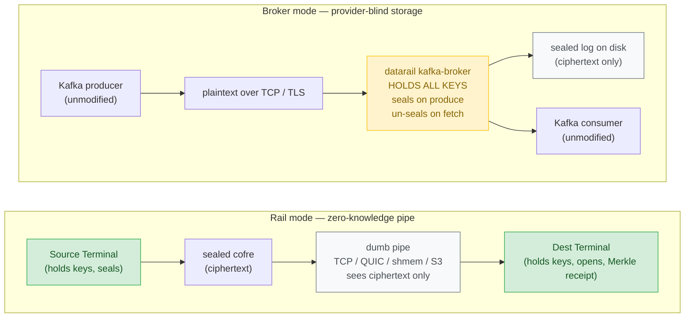

# Datarail

[](https://github.com/HumanGuardrail/HuGR_Datarail/actions/workflows/ci.yml)
[](https://github.com/HumanGuardrail/HuGR_Datarail/actions/workflows/kafka-broker-librdkafka.yml)
[](https://github.com/HumanGuardrail/HuGR_Datarail/actions/workflows/kafka-broker-tls.yml)
[](https://github.com/HumanGuardrail/HuGR_Datarail/actions/workflows/kafka-broker-mtls.yml)
[](https://github.com/HumanGuardrail/HuGR_Datarail/actions/workflows/kafka-broker-compression.yml)

**An end-to-end-sealed data rail, and a Kafka-wire-compatible broker whose storage never sees plaintext.**
Every record is sealed into a per-record vault (X25519 key-wrap, AEAD, signed); delivery carries an
offline-verifiable Merkle receipt; an unmodified Kafka client can produce to it and read back.

*Domain vocabulary is Portuguese by design: a __cofre__ is the sealed per-record vault, its __etiqueta__ the
authenticated envelope/header, the __lacre__ its signature seal, the __carga__ the sealed payload (ciphertext);
__lastro__ ("ballast") is the committed, reproducible evidence backing a claim (see `LASTRO-MATRIX.md`).*

## Status — read this first

**This is a single-node prototype.** No replication, no failover, no cross-node coordination — a
designed-ahead replication/erasure tier exists as tested library code (see the crate table), but nothing
distributed is wired into the shipped binary. Everything below is what one process does on one box, stated at the rigor it
was actually verified at. Where a claim is weaker than it sounds, the weaker version is the true one.

It has **two modes with two different trust models**, and they should never be conflated:

- **Rail mode** (`datarail send / recv / run`): the endpoints hold the keys and seal; every pipe and store in
  between — TCP, QUIC, shared memory, S3 — sees only ciphertext. This is the zero-knowledge claim, and it is
  the mode where it holds.
- **Broker mode** (`datarail kafka-broker` / `kafka-ingest`): the broker process holds all the keys, seals on
  produce and un-seals on fetch. The on-disk log is ciphertext-only — **provider-blind storage** — but whoever
  controls the broker process can read everything. It is encryption-at-rest done properly, not zero-knowledge.

## Doctrine

> **Smart sealed endpoints. Dumb cheap pipes.**

All intelligence and all secrets live in a small terminal at the edge; the rail underneath can be the cheapest,
dumbest substrate available, because a breach of the pipe yields ciphertext. In broker mode the same sealing
buys you a disk that never holds plaintext — the running broker remains a trusted keyholder.



> **Trust boundary note:** In Rail mode nothing in the middle can open a cofre — zero-knowledge holds end-to-end. In Broker mode the broker process is a trusted keyholder; the disk is provider-blind, but the running broker can read everything.

## Measured

Numbers from a benchmark of the **real `datarail kafka-broker` binary**, run by a **separate AI auditor
(Claude), not the author**, with a real client
(kafkacat 1.6.0 / librdkafka 1.8.0; 4 vCPU i7-9750H class, AES-NI, no VAES; 1 KiB records; fsync-before-ack defaults) —
method and raw results in [`docs/BENCH-INDEPENDENT-2026-07-01.md`](docs/BENCH-INDEPENDENT-2026-07-01.md):

- **Cold start: 3.0 ms median** (p90 3.7 ms, n=30) from exec to accepting connections.
- **Memory: 3.3 MB RSS idle, 9 MB peak** through a 50,000-message produce+consume cycle. The binary is 2 MB.
- **Integrity: 50,000 produced → 50,000 consumed, zero loss**, and the data directory grepped clean of
  plaintext — the provider-blind property reproduced by that auditor, outside the author's own harness.
- **Throughput: ~6 MB/s (~6,000 msg/s) per partition as originally measured — first fix landed 2026-07-02.**
  The per-record seal ran inside a global mutex (two producers on two partitions aggregated to 4.4 MB/s:
  *negative* scaling, ~1 core ceiling). The per-batch seal is now parallelized (a reserved seq range + an
  immutable `board_at`): a same-minute interleaved A/B on the same 4 vCPU host measured **~2.5×** (serial
  1.3 → parallel 3.3 MB/s in a degraded-host window; that shared sandbox's absolute numbers drift ~4.5× across
  hours, so trust the ratio, not the absolutes — method in the bench addendum). The current worktree removes the
  global broker-state mutex from partition paths; local WP-01 evidence is tracked separately and is not an
  independent product benchmark.

The older headline figures in the design docs (`~72×` Kafka's RAM, throughput "tie") were measured on
`datarail-omb-shim` — a point-to-point mover, not this broker — at a ~51 MB/s operating point, self-run, n=3
manual dispatches. A documented adversarial self-audit already narrowed those claims once
([`docs/design/ADVERSARIAL-AUDIT.md`](docs/design/ADVERSARIAL-AUDIT.md)); where shim numbers and product
numbers disagree, believe the product numbers above.

## What runs today

Sealed cofres with per-cofre X25519 key-wrap and sealed-sender; an offline-verifiable Merkle delivery proof;
effectively-once delivery **within a process run** (the cross-restart dedup index exists but is not wired into
the broker, which is at-least-once across restarts); content-contract terminals with dead-lettering; three
substrates behind one conformance harness (**shmem · QUIC · object-store/S3**, plus TCP/UDS); FASP delay-based
congestion control with a WAN/netem harness; BLAKE3-`bao` chunk resume; a stateless DoS cookie; and a
`Noise_KK` + SPAKE2 identity/pairing layer.

Product-side: **HTTP → sealed rail → Postgres** on a hand-rolled Postgres driver (no client library; SCRAM-SHA-256 included);
**exactly-once into Postgres** for append-ordered sources and for idempotent Kafka producers (dedup keyed on
the producer's own `(producer_id, partition, sequence)`, landed atomically with the records — CI-gated against
real Postgres 16); and the **bidirectional Kafka drop-in**: unmodified producers and `subscribe()`
consumer-groups, durable offsets, automatic rebalance, multi-partition, TLS / mTLS / SASL-PLAIN / compressed
batches — each CI-gated against real librdkafka. Those CI runs are functional smokes, not a conformance suite.

## Try it

Or just run the 60-second proof: `./scripts/demo.sh` (builds, starts the broker, round-trips a real client if kcat is present, and greps the disk to show it's ciphertext). A recording of that run is in
[`docs/blog/demo.cast`](docs/blog/demo.cast) (asciinema: `asciinema play docs/blog/demo.cast`).

The example [`examples/rail.toml`](examples/rail.toml) enforces an onboarding **content contract**:
`required_prefix = "evt:"`, `max_record_len = 4096`. Payloads below start with `evt:` for that reason. A
violating record is refused at boarding and answered over the Kafka wire with a **non-retriable
`INVALID_RECORD` (87)**, logged broker-side. (Until 2026-07-01 it was answered with a retriable code and
librdkafka would retry forever — found by the independent audit, fixed the same day, regression-tested.)

**Kafka drop-in** — an unmodified producer writes, an unmodified consumer reads back, the disk stays sealed:

```sh
datarail kafka-broker examples/rail.toml --advertised <reachable-host> \
    --data-dir ./datarail-kafka-data --partitions 3
# produce/consume with any Kafka client, e.g.:
#   printf 'evt:hello\n' | kcat -P -b <host>:9092 -t demo
#   kcat -C -b <host>:9092 -t demo -o beginning -e
# Durable (fsync-before-ack): produce → restart the broker → fetch returns the records; committed consumer
# offsets survive restart; on-disk cofres are ciphertext. (Restart survival is verified two ways: store
# reopen AND a SIGKILL harness — crates/datarail-cli/tests/kill9_crash.rs kills the broker mid-produce across 4 rounds and
# asserts every acked record at its exact offset. True power-loss — the page cache does not survive — is
# still future work.) Optional hop security, each CI-gated vs real
# librdkafka: --tls / --tls-client-ca (mTLS) / --sasl-user (SASL/PLAIN; pair with --tls for SASL_SSL),
# compressed producer batches behind --features compression. Transactional producers work in a
# buffer-until-commit model (scope and crash caveats: docs/design/KAFKA-TXN-DESIGN.md and Known limitations).
```

**Kafka ingest → Postgres** — same drop-in surface, landing in a database instead of a log:

```sh
datarail kafka-ingest examples/rail.toml --advertised <reachable-host> \
    --sink-postgres "host=db,user=rail,db=events,table=raw,column=data"
# EXACTLY-ONCE for an idempotent producer (enable.idempotence=true): dedup watermark lands in the same
# Postgres transaction as the records, so producer retries and ingest restarts never double-land.
# A non-idempotent producer is at-least-once (Kafka parity).
```

**Native rail** (no Kafka anywhere) — file/HTTP sources, file/Postgres sinks, real two-process TCP, optional
Noise channel:

```sh
cargo run -p datarail-cli -- validate examples/rail.toml
printf 'evt:a\nevt:b\nevt:c\n' > /tmp/in.txt
cargo run -p datarail-cli -- run examples/rail.toml --source-file /tmp/in.txt --sink-file /tmp/out.txt
# exactly-once into Postgres from an append-ordered source (re-runs never double-land; --at-least-once opts out):
datarail run examples/rail.toml --source-file events.ndjson \
    --sink-postgres "host=db,user=rail,db=events,table=raw,column=data,password=secret"
# two processes over a real socket:
datarail recv examples/rail.toml --listen 127.0.0.1:9000 --sink-file /tmp/out.txt --count 1
datarail send examples/rail.toml --connect 127.0.0.1:9000 evt:hello evt:world
# wrap the hop in Noise_KK (mutual auth + on-wire metadata encryption); pair identities over a short code:
datarail keygen --noise
datarail pair --listen 127.0.0.1:7000 --code 0x<shared-16-byte-code>   # (and --connect on the other side)
```

A route is one declarative `rail.toml`: source, onboarding contract, destination, offloading contract,
`substrate` (`auto`/`loopback` · `tcp` · `shmem` · `s3` · `quic` behind `--features quic`), keys. The example file carries
raw demo secrets by design; real deployments should reference keys, not inline them.

## Known limitations

The sharp edges, before you find them:

- **Single-node.** No replication or failover of any kind; this is the project's largest open front.
- **Throughput scaling is not independently evidenced:** per-partition locking is implemented; local 512-byte
  interleaved A/B samples ranged `1.154x–1.684x` on this host, with high variance. Independent product evidence,
  CI-scale samples, and RSS remain absent. See [`docs/roadmap/WP-01-BENCH-LOCAL-2026-09-12.md`](docs/roadmap/WP-01-BENCH-LOCAL-2026-09-12.md).
- **Transactional crash atomicity remains unproven:** broker now has a durable prepare/commit journal, rollback,
  startup recovery, and deterministic in-process fault points, but process-level restart coverage is still missing.
  Do not treat cross-partition transactions as crash-atomic. See
  [`docs/design/KAFKA-TXN-DURABILITY.md`](docs/design/KAFKA-TXN-DURABILITY.md).
- **Broker restarts are at-least-once** for non-idempotent producers (the general dedup index is not wired in).
- **QUIC substrate ships dev-only embedded certs and the client accepts any server cert** — an active MITM on
  that hop can read envelope (*etiqueta*) metadata — route/stream ids, sequence, timing — never payloads.
  Dev/test only; documented in the crate.
- **Postgres driver: no TLS to the database, no SCRAM-SHA-256-PLUS (channel binding).** Plain
  **SCRAM-SHA-256 landed 2026-07-02** (RFC 7677 vectors tested; non-ASCII passwords rejected rather than
  mis-prepped) alongside trust/cleartext/MD5 — a default PostgreSQL 14+ now authenticates.
- **Self-audited, not third-party audited.** "Fuzz" in this repo means deterministic property tests, not
  coverage-guided fuzzing; "chaos" means in-process fault injection, not a distributed harness. The crypto uses
  vetted crates (dalek, aes-gcm-siv, snow, spake2, blake3) but the construction has not had external review.

## Crates

| Layer | Crates |
|---|---|
| Core seam | `datarail-core` (types/traits) · `datarail-crypto` · `datarail-cofre` (wire + seal/verify) |
| Proof & once | `datarail-manifest` (Merkle proof + `bao` chunk-resume) · `datarail-once` (effectively-once) |
| Rail | `datarail-rail` (substrate trait + loopback/resumable/UDS/TCP + WAN harness + FASP CC + DoS cookie) · `datarail-substrate-{shmem,quic,objectstore}` |
| Terminals & identity | `datarail-terminal` (contract/seal/dead-letter/sealed-sender) · `datarail-identity` (Noise_KK + SPAKE2) |
| Surface & proof | `datarail-spec` (`rail.toml`) · `datarail-cli` (`datarail`) · `datarail-acceptance` · `datarail-bench` |
| Connectors & compat | `datarail-connectors` (HTTP · Postgres · webhook · file) · `datarail-kafka` (Kafka wire protocol + broker serve loop) |
| Designed-ahead (tested library code, **not wired into the shipped CLI**) | `datarail-broker` · `datarail-topic` · `datarail-replicated-topic` · `datarail-replication` · `datarail-erasure` · `datarail-tieredlog` · `datarail-blobstore` · `datarail-netblob` · `datarail-keyrouter` |
| Harnesses | `datarail-system` · `datarail-stress` · `datarail-fuzz` · `datarail-omb-shim` · `datarail-metrics` |

## Map

| Doc | What |
|---|---|
| [`docs/PRODUCT.md`](docs/PRODUCT.md) | What it is and why it exists |
| [`docs/DECOMPOSITION.md`](docs/DECOMPOSITION.md) | Capabilities, acceptance criteria, invariants, milestones |
| [`docs/design/00-CONSTITUTION.md`](docs/design/00-CONSTITUTION.md) | The machine shape + named invariants |
| [`docs/design/DOD-01.md`](docs/design/DOD-01.md) | Definition-of-Done ledger — PROVEN / DIRECTIONAL / PENDING per gate |
| [`docs/design/LASTRO-MATRIX.md`](docs/design/LASTRO-MATRIX.md) | Every load-bearing number → committed repro → rigor label |
| [`docs/design/ADVERSARIAL-AUDIT.md`](docs/design/ADVERSARIAL-AUDIT.md) | Adversarial audit of our own benchmarks — corrections on the record |
| [`docs/design/KAFKA-COMPAT.md`](docs/design/KAFKA-COMPAT.md) | Kafka compat — scope, limits, security boundary |
| [`docs/BENCH-INDEPENDENT-2026-07-01.md`](docs/BENCH-INDEPENDENT-2026-07-01.md) | Independent benchmark of the real broker (the "Measured" numbers) |
| [`docs/BUILD_LOG.md`](docs/BUILD_LOG.md) | Goal lock, decisions, running log |
| [`docs/roadmap/ISSUES.md`](docs/roadmap/ISSUES.md) | Open work as issues — leverage-ordered, with a "done so far" trail |
| [`docs/blog/`](docs/blog/) | Engineering write-ups: negative scaling, auditing my own benchmarks, the Merkle receipt |
| [`SECURITY.md`](SECURITY.md) | Threat model, crypto inventory, reporting |

## How this was built

Solo, in 8 days: ~30K LOC across 34 crates, clippy `deny(all + pedantic)` and `forbid(unsafe)` workspace-wide
(one waiver crate — shmem — with two audited `unsafe` sites). It was built with an AI-fleet execution model and
adversarial self-audit loops: every headline claim was handed to skeptics instructed to break it, and the
corrections stayed in the record. That process is as much the point of this repository as the artifact is; the
audit trail ([`ADVERSARIAL-AUDIT.md`](docs/design/ADVERSARIAL-AUDIT.md),
[`LASTRO-MATRIX.md`](docs/design/LASTRO-MATRIX.md)) is why this README can afford to be specific.

## License

Dual-licensed under [MIT](LICENSE-MIT) or [Apache-2.0](LICENSE-APACHE), at your option.
